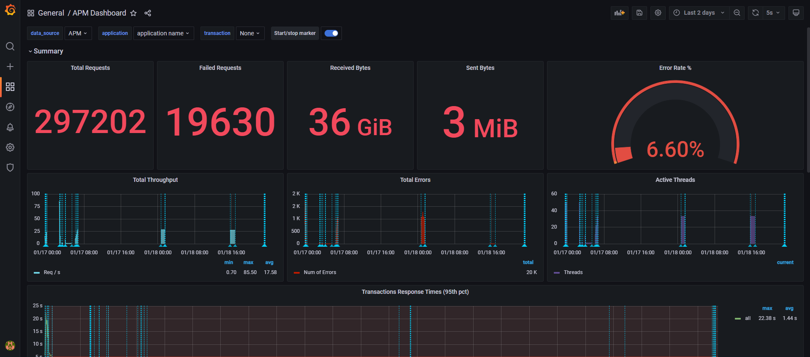
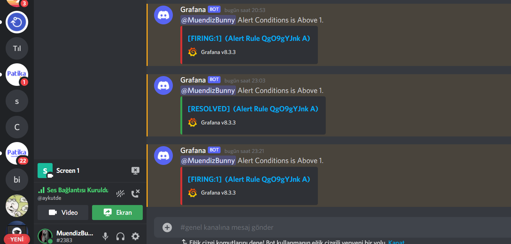

[](https://github.com/berkaypab?tab=repositories)
<br/>
# cicek.com Jmeter Load Tests


## API Request

1-)HomePage
```https
  GET ${BASE_URL_1}/
```


2-)GetLoginOrLogoutEvent
```https
  GET ${BASE_URL_1}/Ani/GetLoginOrLogoutEvent
```

3-)UserMenu
```https
  GET ${BASE_URL_1}/user-menu
```

4-)AjaxHomePageProducts
```https
  GET ${BASE_URL_1}/Product/AjaxHomePageProducts
```

5-)SuggesttedProducts
```https
  GET ${BASE_URL_1}/Suggest/Get/
```
Parameters Getting From CSV File

| Parameter | Value     | 
| :--------- | :--------- |
| `${search_keyword}` | `papatya`   | 
| `${search_keyword}` | `gül` |
| `${search_keyword}` | `bonsai` |


6-)SearchProduct
```https
  GET ${BASE_URL_1}/Arama
```
Parameters Getting From CSV File

| Parameter | Value     | 
| :--------- | :--------- |
| `${search_keyword}` | `papatya`   | 
| `${search_keyword}` | `gül` |
| `${search_keyword}` | `bonsai` |

7-)UserMenu
```https
  GET ${BASE_URL_1}/user-menu
```
8-)ListofProductsSearched
```https
  GET ${BASE_URL_1}/Catalog/AjaxCategory
```
Parameters Getting From CSV File

| Parameter | Value     | 
| :--------- | :--------- |
| `${search_keyword}` | `papatya`   | 
| `${search_keyword}` | `gül` |
| `${search_keyword}` | `bonsai` |

Grafana Discord Alert Bot Added using Webhooks

## Used Technologies
- Grafana APM
- InfluxDB
- Jmeter

## Assertion Types
- Response Code Assertion
- Xpath Assertion 
- Json Assertion

## Test Results From Grafana APM 



[](https://github.com/berkaypab?tab=repositories)
<br/>



[](https://github.com/berkaypab?tab=repositories)
<br/>
