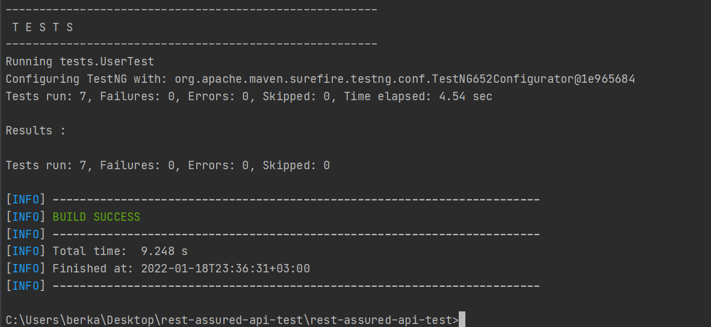

## Used Technologies
- Java
- Maven
- TestNG
- RestAssured
- Gson
- Lombok
- Log4J

## Test Scenarios Negative and Positive

- User Sign Up Successfully
- User Sign Up Existing Account
- User Sign Up With Null Params
- User Sign Up With Wrong Email and Password Length Shorter Than 8
- User Sign Up With Valid Email and Password Length Shorter Than 8
- User Sign In Successfully
- User Sign In Null Params

## Assertions
- Response Code
- Instanceof Variables
- Contains Response Messages

## URL and Path

- USER_BASE_URL = "https://bootcampapi.techcs.io/";
- SIGN_UP_PATH = "api/fe/v1/authorization/signup";
- SIGN_IN_PATH = "api/fe/v1/authorization/signin";

## Result

